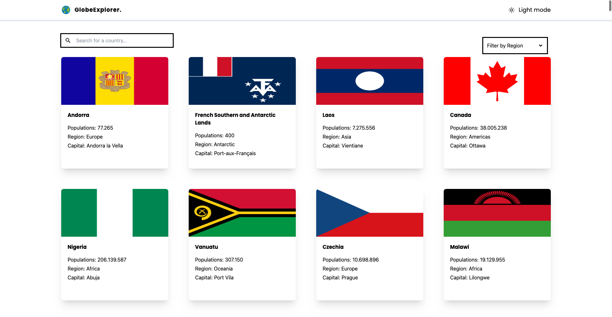
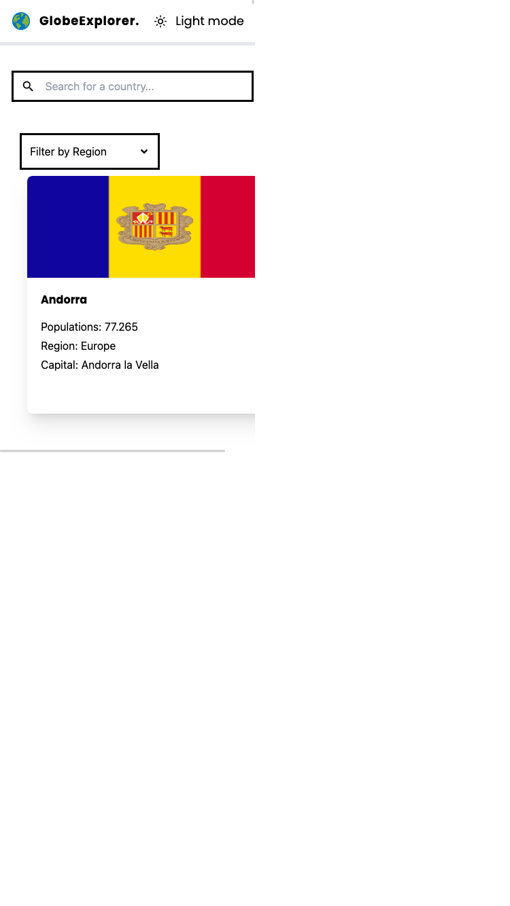

# GlobeExplorer

Welcome to the GlobeExplorer! This web application allows users to explore details about countries, view their locations on an interactive map, and navigate to neighboring countries effortlessly.

## Table of Contents

- [Features](#features)
- [Screenshot](#Screenshot)
- [Technologies Used](#technologies-used)
- [Useful Resources](#useful-resources)
- [License](#license)

## Features

1. **Country List:** Browse through a list of countries. Click on a country to view detailed information.

2. **Country Details:** Detailed information about each country, including name, capital, population, etc. Location displayed on the map.

3. **Interactive Map:** Powered by Leaflet.js, allowing users to visually explore countries and their borders.

4. **Border Navigation:** Click on a country's border on the map to navigate directly to the details page of the neighboring country.

### Screenshot

|  |  |
| ---------------------------------------------------------- | --------------------------------------------------------- |

## Technologies Used

- **React:** JavaScript library for building user interfaces.
- **React Router:** Navigation within the app.
- **Leaflet.js:** Open-source JavaScript library for interactive maps.
- **HTML and CSS:** Structure and styling.
- **Tailwind CSS:** Utility-first CSS framework.

## Useful Resources

- [React Documentation](https://react.dev/): Official documentation for React.

- [React Router Documentation](https://reactrouter.com/en/6.20.1): Learn how to use React Router for navigation.

- [Redux Documentation](https://redux.js.org/introduction/getting-started): Official documentation for Redux state management.

- [Tailwind CSS Documentation](https://tailwindcss.com/docs): Explore the documentation for Tailwind CSS.

- [Google Fonts](https://fonts.google.com/): Browse and integrate beautiful fonts for your project.
